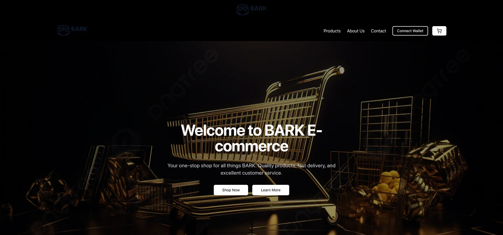

# BARK E-commerce

Welcome to BARK E-commerce, your one-stop shop for all things BARK. This project features a modern e-commerce platform built with Next.js, TypeScript, and Tailwind CSS, and leverages the Solana blockchain for a seamless shopping experience.



## Table of Contents

- [Features](#features)
- [Installation](#installation)
- [Usage](#usage)
- [Configuration](#configuration)
- [Contributing](#contributing)
- [License](#license)

## Features

- **Hero Section**: Eye-catching introduction with a call to action.
- **Features Section**: Highlights key benefits like product selection, delivery, and secure shopping.
- **Featured Products**: Displays top products with detailed information and add-to-cart functionality.
- **Join Community Section**: Newsletter subscription form for exclusive offers and updates.
- **CTA Section**: Encourages users to explore all products.

## Installation

To get started with this project locally, follow these steps:

1. **Clone the Repository**

   ```bash
   git clone https://github.com/barkprotocol/bark-commerce.git
   ```

2. **Navigate to the Project Directory**

   ```bash
   cd bark-commerce
   ```

3. **Install Dependencies**

   ```bash
   npm install
   # or
   yarn install
   ```

4. **Set Up Environment Variables**

   Create a `.env.local` file in the root directory and add the following variables. Use the sample values as placeholders, and replace them with your actual values:

   ```plaintext
   NEXT_PUBLIC_SUPABASE_URL=
   NEXT_PUBLIC_SUPABASE_ANON_KEY=
   NEXT_PUBLIC_SOLANA_NETWORK=devnet
   NEXT_PUBLIC_SOLANA_RPC_URL=https://api.devnet.solana.com
   NEXT_PUBLIC_MINT_API_URL=

   BARK_COMMERCE_API_URL=https://api.example.com
   BARK_COMMERCE_API_KEY=your-api-key-here

   SOLANA_MAINNET_RPC_URL=insert_url_here
   SOLANA_DEVNET_RPC_URL=insert_url_here

   HELIUS_MAINNET_RPC_URL=https://mainnet.helius-rpc.com/?api-key=
   HELIUS_DEVNET_RPC_URL=https://devnet.helius-rpc.com/?api-key=

   PROXY_WALLET_SK=insert_key_here
   SERVER_WALLET_SK=insert_key_here

   SHYFT_API_KEY=https://rpc.shyft.to?api_key=c1AmdE28Ks7cwKzp

   GMAIL_CLIENT_ID=insert_id_here
   GMAIL_CLIENT_SECRET=insert_secret_here
   GMAIL_REDIRECT_URI=https://developers.google.com/oauthplayground
   GMAIL_REFRESH_TOKEN=insert_refresh_here
   EMAIL_USER=insert_email_here
   EMAIL_FROM=insert_email_here
   ```

## Usage

1. **Start the Development Server**

   ```bash
   npm run dev
   # or
   yarn dev
   ```

2. **Open your browser and navigate to [`http://localhost:3000`](http://localhost:3000)** to see the application in action.

3. **For production deployment**, ensure to set up environment variables and build the project:

   ```bash
   npm run build
   # or
   yarn build
   ```

   Deploy the project to Vercel or your preferred hosting provider.

## Configuration

- **Styling**: Uses Tailwind CSS for styling. Customize the configuration in `tailwind.config.js`.
- **Fonts**: Google Fonts Oswald for titles, Poppins Light for body text, and Syne fonts.
- **Wallet Integration**: Includes Phantom, Solflare, and Backpack wallets using `@solana/wallet-adapter-react`.

## ToDo

- Solana actions and blinks

## Contributing

If you would like to contribute to this project, please follow these guidelines:

1. **Fork the Repository** and create a new branch.
2. **Make your changes** and ensure they are well-tested.
3. **Submit a Pull Request** with a clear description of the changes.

## License

This project is licensed under the MIT License. See the [LICENSE](LICENSE) file for more details.